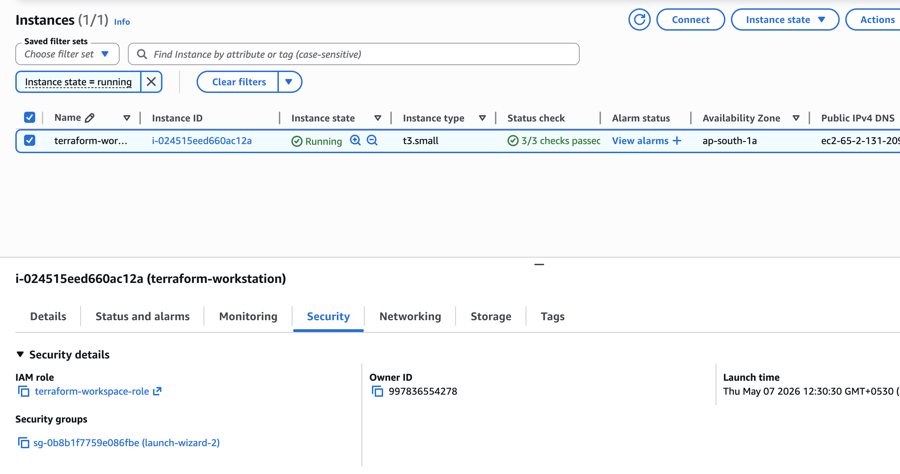

- Cloud used : AWS
- Created an EC2 instance in AWS where ther terraform will run
- Installing terraform in the VM
- Creating a role called terraform-workspace-role in AWS, with access like EC2full access, s3 full access, Loadbalancerfull access etc
- now attaching this role to the ec2 instance 
